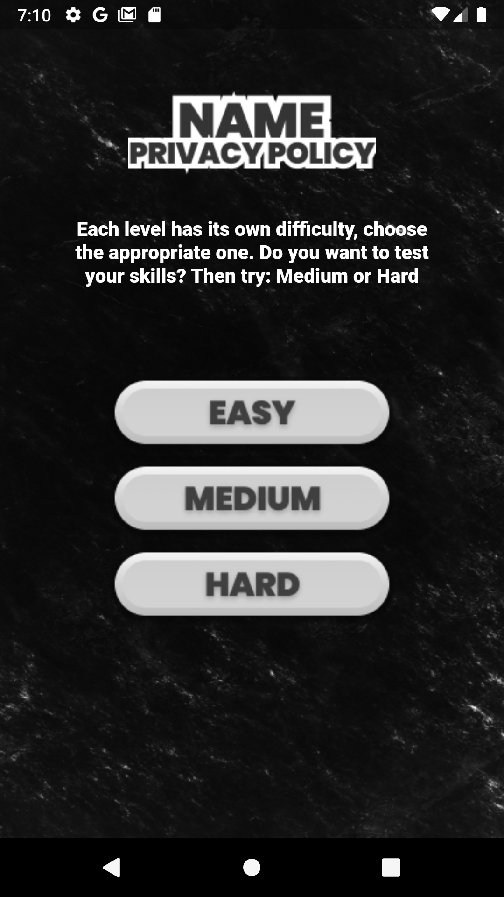
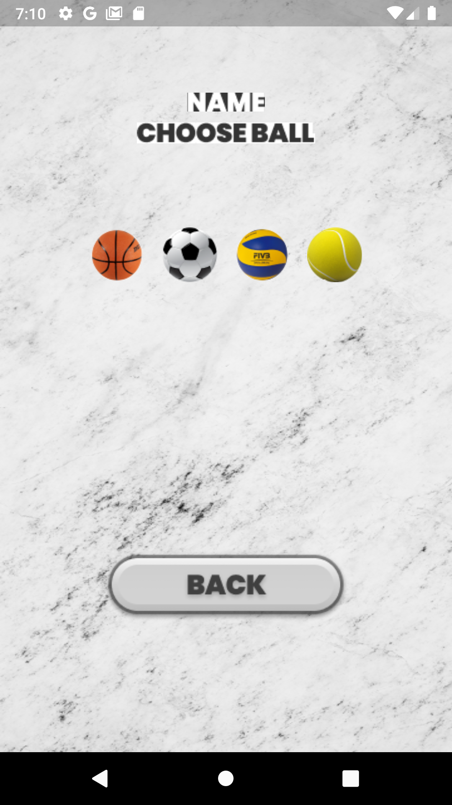
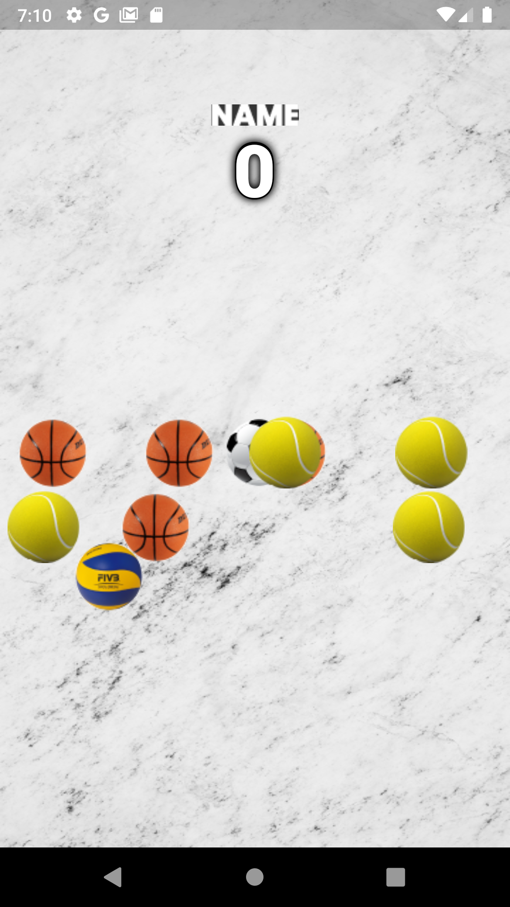

# все настройки смотри файл config.dart (сейчас включет тест моде(показ демо банеров)) \
 сейчас стоит(testMode=true) только на настоящем устройстве используй (testMode=false) \
 иначе может не показывать рекламу, так же в режиме testMode=false может не показывать рекламу с впном если ему ip не подравится или или сам впн рекламу блокирует
# flutter build apk --release --no-tree-shake-icons - такой строчкой собирать релиз \

  
  &nbsp&nbsp&nbsp&nbsp&nbsp&nbsp&nbsp
  
   &nbsp&nbsp&nbsp&nbsp&nbsp&nbsp&nbsp
  

